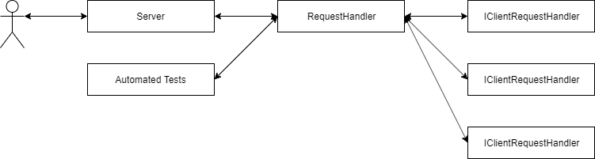

# Standard Server
Nexus HTTP Server attempts to abstract handling HTTP
requests from clients to returning requests for specific URLs,
and handling requests with the context of the parameters and
the body.

## Creating the Server
The system is set up to have a `RequestHandler` object
be given to an `HttpServer` object. Other `IClientRequestHandler`
objects are registered to the `RequestHandler`. The reason there
is a seprate request hanlder is to allow for easier testing without
having to create a server instance. Optionally, multiple server
objects can be used to listen on different ports if needed.



```csharp
using Nexus.Http.Server.Http.Request;
using Nexus.Http.Server.Http.Server;

namespace Demo
{
    public class Program
    {
        public static void Main(string[] args)
        {
            // Create the request handlers.
            var handler = new RequestHandler();

            // Create and start the server.
            var server = new HttpServer(8080,handler);
            server.Start();
        }
    }
}
```

If you run the code above and open up a browser and
go to `http://localhost:8080`, you will see the message
"Invalid request".

## Adding Client Request Handlers
While the code above works, it isn't useful since it
doesn't handle any requests. To make it useful, it has to
be set up to handle requests. To add a handler, you need to
provide the following:
- The HTTP method (`GET`, `POST`, `PATCH`, etc)
- The relative URL
- The handler that implements `IClientRequestHandler`

```csharp
using Nexus.Http.Server.Http.Request;
using Nexus.Http.Server.Http.Response;
using Nexus.Http.Server.Http.Server;

namespace Demo
{
    public class Program
    {
        public class Handler : IClientRequestHandler
        {
            /*
             * Returns a response for a given request.
             */
            public HttpResponse GetResponseData(HttpRequest request)
            {
                return new HttpResponse(200,"text/html","Hello world!");
            }
        }
        
        public static void Main(string[] args)
        {
            // Create the request handlers.
            var handler = new RequestHandler();
            handler.RegisterHandler("GET","/",new Handler());
            handler.RegisterHandler("GET","/test",new Handler());

            // Create and start the server.
            var server = new HttpServer(8080,handler);
            server.Start();
        }
    }
}
```

The code above adds registers for `http://localhost:8080` and 
`http://localhost:8080/test` and returns a "Hello world!" message.
Since text responses are common, `HttpResponse.CreateSuccessResponse`
can be used for the example above.

```csharp
using Nexus.Http.Server.Http.Request;
using Nexus.Http.Server.Http.Response;
using Nexus.Http.Server.Http.Server;

namespace Demo
{
    public class Program
    {
        public class Handler : IClientRequestHandler
        {
            /*
             * Returns a response for a given request.
             */
            public HttpResponse GetResponseData(HttpRequest request)
            {
                return HttpResponse.CreateSuccessResponse("Hello world!");
            }
        }
        
        public static void Main(string[] args)
        {
            // Create the request handlers.
            var handler = new RequestHandler();
            handler.RegisterHandler("GET","/",new Handler());
            handler.RegisterHandler("GET","/test",new Handler());

            // Create and start the server.
            var server = new HttpServer(8080,handler);
            server.Start();
        }
    }
}
```

## URL Parameters
URL parameters can also be parsed from the request. The `HttpRequest`
class passed into the `GetResponseData` method contains a `URL` object
and the body of the request (`""` if not present, like in `GET` requests).

```csharp
using Nexus.Http.Server.Http.Request;
using Nexus.Http.Server.Http.Response;
using Nexus.Http.Server.Http.Server;

namespace Demo
{
    public class Program
    {
        public class Handler : IClientRequestHandler
        {
            /*
             * Returns a response for a given request.
             */
            public HttpResponse GetResponseData(HttpRequest request)
            {
                return HttpResponse.CreateSuccessResponse("Hello world!");
            }
        }
        
        public static void Main(string[] args)
        {
            // Create the request handlers.
            var handler = new RequestHandler();
            handler.RegisterHandler("GET","/",new Handler());
            handler.RegisterHandler("GET","/test",new Handler());

            // Create and start the server.
            var server = new HttpServer(8080,handler);
            server.Start();
        }
    }
}
```

Using the `http://localhost:8080` and `http://localhost:8080/test`
URLs in a browser will show the same results, but using
`http://localhost:8080?param=Test%20param` and `http://localhost:8080/test?param=Test%20param`
will show `Test param` on the second line. If a parameter isn't
defined, null is returned.
